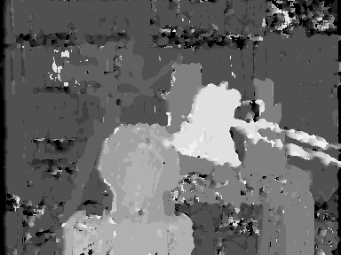

# Block Matching Algorithm for Stereo Matching
A C++ implementation of Block Matching Algorithm for stereo matching. It uses the "SAD" (Sum of Absolute Differences) similarity metric.

## Input Image
The Tsukuba stereo image that used as input.

   

## Output Image
The disparity map that created at the output.

   

